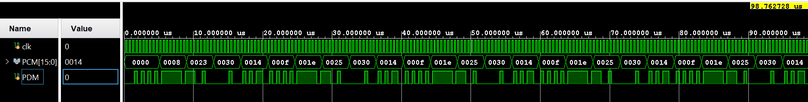
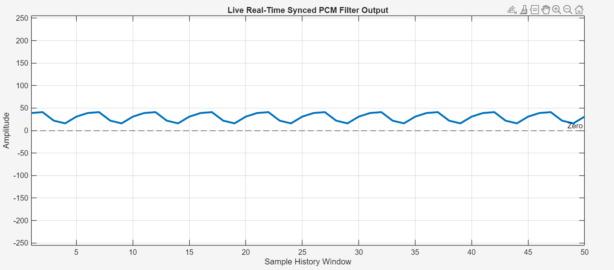
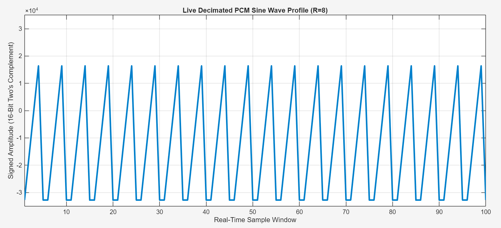

# PDM-PCM Audio Decimator

**Difficulty:** Intermediate

**Uses MCU:** Yes (RP2040)

**External Hardware:** Vicharak Shrike Lite, PDM MEMS Microphone Breakout Board, Jumper Cables

## Overview
This project implements a lightweight **PDM-to-PCM audio conversion pipeline** using a **3-stage CIC (Cascaded Integrator Comb) filter** on FPGA fabric. The goal is to convert high-speed 1-bit PDM microphone data into usable 16-bit PCM audio while operating under strict FPGA resource limitations.
Because traditional FIR/MAC-based filters are too resource-intensive, the system uses a CIC filter architecture built entirely from:
- Adders
- Subtractors
- Delay registers

This allows real-time audio decimation with very low FPGA utilization.
- **1-bit 2 MHz PDM**
→ into → **16-bit PCM at 32 kHz**

## Compatibility

| Board                | Firmware                | Status     |
| -------------------- | ----------------------- | ---------- |
| Shrike Lite (RP2040) | `firmware/micropython/` | ✅ Tested   |
| Shrike (RP2350)      | N/A                     | ⬜ Untested |
| Shrike-fi (ESP32-S3) | N/A                     | ⬜ Untested |

## Hardware Setup
PDM MEMS Microphone Breakout Board is required to capture audio signals and convert them into PDM output.

## FPGA Pin Mapping 

| FPGA GPIO Pin | Signal Name | Direction | Description              |
| ------------- | ----------- | --------- | ------------------------ |
| 3             | `spi_sck`   | Input     | SPI clock                |
| 4             | `spi_ss_n`  | Input     | Chip select (active low) |
| 5             | `spi_mosi`  | Input     | MOSI (receive)           |
| 6             | `spi_miso`  | Output    | MISO (transmit)          |
| 18            | `rst_n`     | Input     | Reset (active low)       |
| 17            | `PDM`       | Input     | PDM bitstream from Microphone              |

### RP2040 Connections

| RP2040 Pin | Signal Name | Direction | Description               |
| ---------- | ----------- | --------- | ------------------------- |
| 2          | SCK         | Output    | SPI clock                 |
| 1          | CS          | Output    | Chip select               |
| 3          | MOSI        | Output    | Master output             |
| 0          | MISO        | Input     | Master input              |
| 14         | Reset       | Output    | Reset signal (active low) |

The Shrike Lite board provides only six hardwired FPGA-to-MCU interconnect signals. Due to this limitation, PCM audio samples cannot be transferred using a wide parallel interface.
To overcome this constraint:
* FPGA operates as SPI Slave
* RP2040 operates as SPI Master

## Quick Start

1. Connect your Shrike board via USB
2. Upload `bitstream/your_example.bin` using ShrikeFlash
3. Copy `rp2040_spi_audio_receiver.py` to the Thonny IDE
4. Execute the script
5. Run `realtime_pcm_plotter.m` to visualize incoming PCM samples in real time.
   Replace COM4 with the respective port number.

## Build From Source

### FPGA (Verilog)

1. Open `pdmtopcm.ffpga` in Go Configure Software Hub
2. Click Synthesize → Generate Bitstream
3. Output will be in `ffpga/build/`

### Firmware (Thonny IDE)
1. Select your board (Raspberry Pi Pico or ESP32-S3)
2. Upload `rp2040_spi_audio_receiver.py` in Thonny IDE

### Firmware (MATLAB)
1. Update `realtime_pcm_plotter.m` with the correct port number.
2. Run the script

Available implementations:

| File                 | Description                      |
| -------------------- | -------------------------------- |
| `pdm_to_pcm_8bit.v`  | 8-bit PCM output implementation  |
| `pdm_to_pcm.v`       | Final 16-bit PCM output implementation  |

### Simulation

Simulation files are located in: `ffpga/sim/`
The RTL simulation verifies:

* CIC filter functionality
* PCM sample generation
* SPI communication logic
* Timing correctness

### Simulation Output

PDM-PCM Simulation

## How It Works

### 1. PDM Audio Capture

The PDM microphone generates a high-frequency 1-bit PDM stream representing the audio waveform and sends the 1-bit bitstream to the FPGA fabric.

### 2. CIC Filtering and Decimation

The FPGA implements a CIC filter that:

* Integrates incoming PDM samples
* Performs decimation
* Generates lower-rate PCM samples

To verify output, two PCM implementations are provided:
* 8-bit PCM output
* 16-bit PCM output (Final Implementation)

### 3. SPI Transfer
Generated PCM samples are serialized and transferred from the FPGA to the RP2040 via SPI.

### 4. MATLAB Visualization
The RP2040 forwards PCM samples to the host PC where MATLAB visualizes the waveform in real time.

## Expected Output

### 8-bit PCM Output

### Final PCM Output

The generated waveform should resemble the original input pattern, with the 16-bit implementation providing higher amplitude resolution.
Here, the final output resembles a sine waveform.

## References

* https://ieeexplore.ieee.org/document/10153161
* https://ieeexplore.ieee.org/document/11385174
---
